# Infraestructura 2: VPN Site-to-Site Router Cisco ↔ FortiGate

**Autor:** Omar Paulino
**Matrícula:** 20251325
**Plataforma:** GNS3, Cisco c2691 (IOS 12.4), FortiGate VM 7.0.9, Cisco IOSvL2, Ubuntu Cloud 24.04

---

## Video de demostración

**[Ver el video de la práctica](PEGAR_AQUI_EL_LINK_DEL_VIDEO)**

En el video muestro el funcionamiento de la VPN entre el router Cisco y el FortiGate:

- El Usuario llega al Servidor Web por HTTPS a través del túnel.
- Con la VPN abajo, el Usuario ya no llega al servidor.

---

## Contenido

1. [Propósito de la práctica](#1-propósito-de-la-práctica)
2. [Qué cambié respecto a la Infraestructura 1](#2-qué-cambié-respecto-a-la-infraestructura-1)
3. [Topología](#3-topología)
4. [Direccionamiento IP y redes](#4-direccionamiento-ip-y-redes)
5. [Cableado en GNS3](#5-cableado-en-gns3)
6. [Switches](#6-switches)
7. [Router Cisco R1-1325](#7-router-cisco-r1-1325)
8. [FortiGate FMW2-1325](#8-fortigate-fmw2-1325)
9. [Compatibilidad de la VPN entre Cisco y FortiGate](#9-compatibilidad-de-la-vpn-entre-cisco-y-fortigate)
10. [Dispositivos finales](#10-dispositivos-finales)
11. [Verificación del funcionamiento](#11-verificación-del-funcionamiento)
12. [Problemas que encontré y cómo los resolví](#12-problemas-que-encontré-y-cómo-los-resolví)

---

## 1. Propósito de la práctica

El objetivo de esta práctica fue **montar una VPN IPsec Site-to-Site entre equipos de dos fabricantes distintos**: un **router Cisco c2691** en el Sitio 1 y un **FortiGate** en el Sitio 2.

Con esto demuestro que IPsec es un estándar abierto: dos equipos de marcas diferentes pueden levantar un túnel cifrado si ambos extremos acuerdan los mismos parámetros de Fase 1 y Fase 2.

Igual que en la Infraestructura 1:

- El **Usuario** (VLAN 10, Sitio 1) solo puede llegar al **Servidor Web HTTPS** (Sitio 2) a través del túnel.
- Los dos sitios mantienen salida a Internet por NAT.

### Requisitos y cómo los cumplí

| Requisito | Cómo lo cumplí |
| --- | --- |
| Un FortiGate configurado por GUI | FMW2-1325 (FortiOS 7.0.9), todo por GUI salvo la IP inicial de gestión |
| Un equipo de red, preferiblemente Cisco | Router Cisco c2691 `R1-1325`, IOS 12.4(25d) `C2691-ADVSECURITYK9-M`, configurado por CLI |
| Configuraciones de red | Router: interfaces, IP secundaria, subinterfaz 802.1Q para la VLAN 10, DHCP y ruta por defecto. FortiGate: interfaces, IP secundarias, DNS y ruta por defecto |
| NAT | Router: PAT con el pool `SALIDA-INTERNET` y la ACL `NAT-USUARIOS`. FortiGate: política `SERVIDOR-INTERNET` con NAT |
| VPN Site-to-Site entre los dos equipos | IPsec IKEv1: crypto map en el router ↔ túnel por interfaz en el FortiGate, entre `200.25.13.13` y `200.25.13.25` |
| ISP con IP públicas | Switch IOSvL2-1 + nube NAT1, con IP públicas simuladas en la WAN de cada equipo |
| Servidor Web en una /28 con HTTPS | Ubuntu + Apache con SSL en `10.13.25.128/28` (IP `10.13.25.130`) |
| Usuarios en una /25, VLAN 10, DHCP y traceroute | Ubuntu en la VLAN 10 `10.13.25.0/25`, con IP por DHCP del router |

---

## 2. Qué cambié respecto a la Infraestructura 1

Partí del proyecto de la Infraestructura 1 y **reemplacé el FW1 por el router Cisco**, conectado en los mismos puertos y con las mismas IP. Así el resto de la red no tuvo que cambiar.

| Elemento | Cambio |
| --- | --- |
| FW1-1325 | Lo eliminé. En su lugar puse el router Cisco c2691 `R1-1325` |
| webterm-1 del Sitio 1 | Lo eliminé, porque el router se configura por consola y no necesita navegador |
| FMW2-1325 | Solo cambié los parámetros de cifrado del túnel `VPN-SITIO1` para que coincidan con lo que soporta el router (sección 8.8) |
| Webterm del Sitio 2 | Mismo equipo y misma IP; en esta topología se llama `webterm-1` |
| NAT1, IOSvL2-1, IOSvL2-2, IOSvL2-3, Usuario, WebServer | Sin cambios |

---

## 3. Topología

### Topología en GNS3

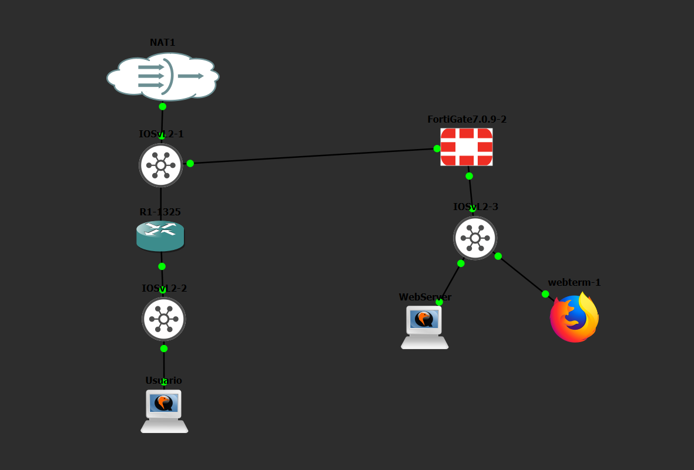

### Diagrama lógico

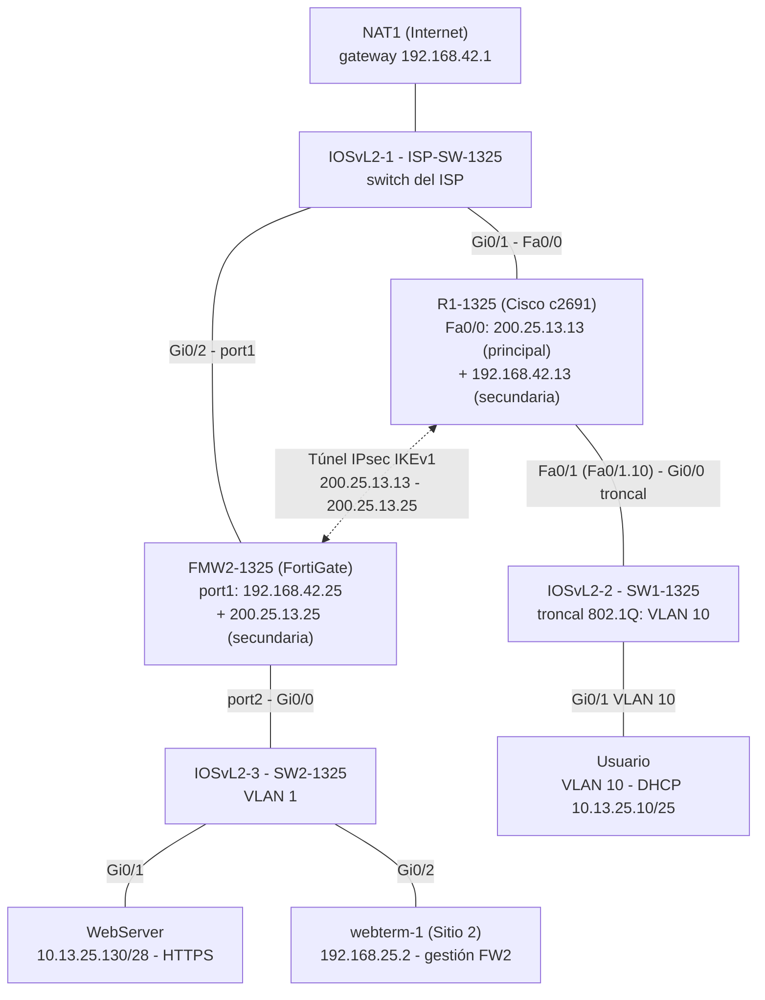
```mermaid
flowchart TB
    NAT1["NAT1 (Internet)<br/>gateway 192.168.42.1"]
    ISP["IOSvL2-1 - ISP-SW-1325<br/>switch del ISP"]
    R1["R1-1325 (Cisco c2691)<br/>Fa0/0: 200.25.13.13 (principal)<br/>+ 192.168.42.13 (secundaria)"]
    FW2["FMW2-1325 (FortiGate)<br/>port1: 192.168.42.25<br/>+ 200.25.13.25 (secundaria)"]
    SW1["IOSvL2-2 - SW1-1325<br/>troncal 802.1Q: VLAN 10"]
    SW2["IOSvL2-3 - SW2-1325<br/>VLAN 1"]
    U["Usuario<br/>VLAN 10 - DHCP 10.13.25.10/25"]
    WS["WebServer<br/>10.13.25.130/28 - HTTPS"]
    WT["webterm-1 (Sitio 2)<br/>192.168.25.2 - gestión FW2"]

    NAT1 --- ISP
    ISP ---|Gi0/1 - Fa0/0| R1
    ISP ---|Gi0/2 - port1| FW2
    R1 <-.->|"Túnel IPsec IKEv1<br/>200.25.13.13 - 200.25.13.25"| FW2
    R1 ---|"Fa0/1 (Fa0/1.10) - Gi0/0 troncal"| SW1
    SW1 ---|Gi0/1 VLAN 10| U
    FW2 ---|port2 - Gi0/0| SW2
    SW2 ---|Gi0/1| WS
    SW2 ---|Gi0/2| WT
```

### Flujo del tráfico Usuario → Servidor Web

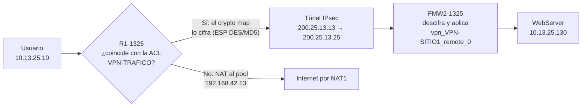
```mermaid
flowchart LR
    U["Usuario<br/>10.13.25.10"] --> R1{"R1-1325<br/>¿coincide con la ACL<br/>VPN-TRAFICO?"}
    R1 -- "Sí: el crypto map<br/>lo cifra (ESP DES/MD5)" --> T["Túnel IPsec<br/>200.25.13.13 → 200.25.13.25"]
    T --> FW2["FMW2-1325<br/>descifra y aplica<br/>vpn_VPN-SITIO1_remote_0"] --> WS["WebServer<br/>10.13.25.130"]
    R1 -- "No: NAT al pool<br/>192.168.42.13" --> I["Internet por NAT1"]
```

---

## 4. Direccionamiento IP y redes

El direccionamiento sigue derivado de mi matrícula **2025-1325**, igual que en la Infraestructura 1.

### 4.1 Redes

| Red | Máscara | VLAN | Gateway | Uso |
| --- | --- | --- | --- | --- |
| 10.13.25.0/25 | 255.255.255.128 | 10 | 10.13.25.1 (R1-1325) | Usuarios del Sitio 1, con DHCP del router |
| 10.13.25.128/28 | 255.255.255.240 | sin VLAN | 10.13.25.129 (FMW2-1325) | Servidor Web del Sitio 2 |
| 200.25.13.0/27 | 255.255.255.224 | — | — | IP públicas simuladas, extremos de la VPN |
| 192.168.42.0/24 | 255.255.255.0 | — | 192.168.42.1 (NAT1) | Salida real a Internet |
| 192.168.25.0/24 | 255.255.255.0 | sin VLAN | 192.168.25.1 (FMW2-1325) | Gestión del FortiGate (webterm) |

### 4.2 Direcciones por equipo

| Equipo | Interfaz | Dirección IP | Uso |
| --- | --- | --- | --- |
| R1-1325 | FastEthernet0/0 (principal) | 200.25.13.13/27 | IP pública simulada, origen de la VPN |
| R1-1325 | FastEthernet0/0 (secundaria) | 192.168.42.13/24 | Salida a Internet por NAT1 |
| R1-1325 | FastEthernet0/1 | sin IP | Interfaz física de la troncal |
| R1-1325 | FastEthernet0/1.10 (dot1Q 10) | 10.13.25.1/25 | Gateway y servidor DHCP de la VLAN 10 |
| FMW2-1325 | port1 (principal) | 192.168.42.25/24 | Salida a Internet por NAT1 |
| FMW2-1325 | port1 (secundaria) | 200.25.13.25/27 | IP pública simulada, extremo de la VPN |
| FMW2-1325 | port2 (principal) | 192.168.25.1/24 | Gestión por GUI |
| FMW2-1325 | port2 (secundaria) | 10.13.25.129/28 | Gateway del Servidor Web |
| Usuario | ens3 | 10.13.25.10/25 (DHCP) | Cliente |
| WebServer | ens3 | 10.13.25.130/28 (fija) | Servidor HTTPS |
| webterm-1 (Sitio 2) | eth0 | 192.168.25.2/24 (fija) | Acceso a la GUI del FW2 |

### 4.3 Decisiones de diseño

- **En el router la IP pública es la principal, al revés que en el FortiGate.** Cisco IOS siempre origina el tráfico propio del router (incluida la negociación IKE de la VPN) desde la IP principal de la interfaz. Por eso puse `200.25.13.13` como principal y `192.168.42.13` como secundaria. En el FortiGate esto se resuelve con la opción *Local Gateway*, que en Cisco no existe para crypto maps.
- **La salida a Internet usa la IP secundaria mediante un pool de NAT.** NAT1 solo sabe devolver tráfico a la red `192.168.42.0/24`. Con `ip nat inside source list ... interface FastEthernet0/0 overload` el router traduciría a su IP principal (`200.25.13.13`) y la respuesta nunca volvería. Por eso creé un pool de una sola IP, `192.168.42.13`, con `overload` (sección 7.4).
- **Las dos LAN no se solapan**: `10.13.25.0/25` termina en `.127` y `10.13.25.128/28` empieza en `.128`.
- **No existe ninguna ruta estática hacia la LAN remota en el router.** El tráfico hacia `10.13.25.128/28` sigue la ruta por defecto, y es el crypto map el que lo cifra al salir por `Fa0/0`. Si el crypto map no está, el paquete sale sin cifrar con una IP privada y NAT1 lo descarta, así que no hay forma de llegar al servidor sin la VPN.
- **Clave precompartida de la VPN:** `Vpn#20251325`, igual en los dos extremos.

---

## 5. Cableado en GNS3

| Desde | Puerto | Hasta | Puerto |
| --- | --- | --- | --- |
| NAT1 | nat0 | IOSvL2-1 (ISP-SW-1325) | Gi0/0 |
| IOSvL2-1 | Gi0/1 | R1-1325 | FastEthernet0/0 |
| IOSvL2-1 | Gi0/2 | FortiGate7.0.9-2 (FMW2-1325) | port1 |
| R1-1325 | FastEthernet0/1 | IOSvL2-2 (SW1-1325) | Gi0/0 |
| IOSvL2-2 | Gi0/1 | Usuario | e0 (ens3) |
| FMW2-1325 | port2 | IOSvL2-3 (SW2-1325) | Gi0/0 |
| IOSvL2-3 | Gi0/1 | WebServer | e0 (ens3) |
| IOSvL2-3 | Gi0/2 | webterm-1 (Sitio 2) | eth0 |

Al añadir el router en GNS3 le calculé el valor de **Idle-PC** (clic derecho → *Idle-PC*) para que Dynamips no consumiera el 100% de la CPU.

---

## 6. Switches

Los tres switches quedaron **exactamente igual que en la Infraestructura 1**. Los comandos están en [`scripts/switches/`](scripts/switches/) y los running-configs en [`running-configs/`](running-configs/).

En `ISP-SW-1325` el puerto Gi0/1 conserva la descripción "Hacia FW1 port1 (WAN)" de la Infraestructura 1, aunque ahora conecta al router.

### 6.1 IOSvL2-1: ISP-SW-1325

| Puerto | Descripción | Modo |
| --- | --- | --- |
| Gi0/0 | Hacia NAT1 (Internet) | access, VLAN 1 |
| Gi0/1 | Hacia la WAN del router (Fa0/0) | access, VLAN 1, portfast edge |
| Gi0/2 | Hacia FW2 port1 (WAN) | access, VLAN 1, portfast edge |

### 6.2 IOSvL2-2: SW1-1325

| Puerto | Descripción | Modo | VLAN |
| --- | --- | --- | --- |
| Gi0/0 | Troncal hacia el router (Fa0/1) | trunk 802.1Q, nonegotiate | permitidas 10,99, nativa 99 |
| Gi0/1 | Usuario | access, portfast edge | 10 (USUARIOS) |
| Gi0/2 | Sin equipo (era el webterm-1 de la Infraestructura 1) | access, portfast edge | 99 (GESTION) |

La **VLAN 10** viaja **etiquetada** por la troncal y llega a la subinterfaz `FastEthernet0/1.10` del router (`encapsulation dot1Q 10`). La VLAN 99 nativa quedó configurada desde la Infraestructura 1, pero en esta topología no se usa: el router no tiene IP en la interfaz física `Fa0/1`.

Verificación en SW1:

```
SW1-1325#show interfaces trunk

Port        Mode             Encapsulation  Status        Native vlan
Gi0/0       on               802.1q         trunking      99

Port        Vlans allowed on trunk
Gi0/0       10,99

Port        Vlans allowed and active in management domain
Gi0/0       10,99

Port        Vlans in spanning tree forwarding state and not pruned
Gi0/0       10,99
```

```
SW1-1325#show vlan brief

VLAN Name                             Status    Ports
---- -------------------------------- --------- -------------------------------
1    default                          active    Gi0/3, Gi1/0, Gi1/1, Gi1/2
                                                Gi1/3
10   USUARIOS                         active    Gi0/1
99   GESTION                          active    Gi0/2
1002 fddi-default                     act/unsup
1003 token-ring-default               act/unsup
1004 fddinet-default                  act/unsup
1005 trnet-default                    act/unsup
```

### 6.3 IOSvL2-3: SW2-1325

| Puerto | Descripción | Modo |
| --- | --- | --- |
| Gi0/0 | Hacia FW2 port2 | access, VLAN 1, portfast edge |
| Gi0/1 | WebServer | access, VLAN 1, portfast edge |
| Gi0/2 | webterm (gestión del FW2) | access, VLAN 1, portfast edge |

---

## 7. Router Cisco R1-1325

Configuré el router completamente por **CLI** desde la consola de GNS3. Los comandos completos están en [`scripts/router/01_R1-1325_configuracion.ios`](scripts/router/01_R1-1325_configuracion.ios) y el running-config en [`running-configs/R1-1325.txt`](running-configs/R1-1325.txt).

### 7.1 Imagen y verificación de soporte de cifrado

Primero comprobé que la imagen del router soporta IPsec. El sufijo **K9** indica que incluye cifrado:

```
R1-1325#show version | include Software
Cisco IOS Software, 2600 Software (C2691-ADVSECURITYK9-M), Version 12.4(25d), RELEASE SOFTWARE (fc1)
ROM: 2600 Software (C2691-ADVSECURITYK9-M), Version 12.4(25d), RELEASE SOFTWARE (fc1)
```

### 7.2 Interfaces

```
enable
configure terminal
hostname R1-1325
no ip domain-lookup
!
interface FastEthernet0/0
 description WAN hacia ISP (IOSvL2-1)
 ip address 200.25.13.13 255.255.255.224
 ip address 192.168.42.13 255.255.255.0 secondary
 ip nat outside
 no shutdown
!
interface FastEthernet0/1
 description LAN troncal hacia IOSvL2-2
 no ip address
 no shutdown
!
interface FastEthernet0/1.10
 description VLAN10 USUARIOS
 encapsulation dot1Q 10
 ip address 10.13.25.1 255.255.255.128
 ip nat inside
```

| Interfaz | Configuración | Explicación |
| --- | --- | --- |
| Fa0/0 | `200.25.13.13/27` principal + `192.168.42.13/24` secundaria, `ip nat outside`, `crypto map CMAP-1325` | WAN del router: lado externo del NAT y punto donde se aplica la VPN |
| Fa0/1 | Sin IP, `no shutdown` | Solo transporta la troncal; la IP va en la subinterfaz |
| Fa0/1.10 | `encapsulation dot1Q 10`, `10.13.25.1/25`, `ip nat inside` | Router-on-a-stick: recibe las tramas etiquetadas con la VLAN 10. Lado interno del NAT |

Resultado:

```
R1-1325#show ip interface brief
Interface                  IP-Address      OK? Method Status                Protocol
FastEthernet0/0            200.25.13.13    YES NVRAM  up                    up
Serial0/0                  unassigned      YES NVRAM  administratively down down
FastEthernet0/1            unassigned      YES NVRAM  up                    up
FastEthernet0/1.10         10.13.25.1      YES NVRAM  up                    up
Serial0/1                  unassigned      YES NVRAM  administratively down down
Serial0/2                  unassigned      YES NVRAM  administratively down down
FastEthernet1/0            unassigned      YES NVRAM  administratively down down
NVI0                       unassigned      NO  unset  up                    up
```

`show ip interface brief` solo muestra la IP principal de cada interfaz. La secundaria `192.168.42.13` se ve en el running-config y en la tabla de rutas.

### 7.3 Servidor DHCP para la VLAN 10

```
ip dhcp excluded-address 10.13.25.1 10.13.25.9
ip dhcp excluded-address 10.13.25.101 10.13.25.127
!
ip dhcp pool VLAN10-USUARIOS
 network 10.13.25.0 255.255.255.128
 default-router 10.13.25.1
 dns-server 8.8.8.8 1.1.1.1
```

| Parámetro | Valor | Explicación |
| --- | --- | --- |
| Red del pool | 10.13.25.0/25 | La red de la VLAN 10 |
| Direcciones excluidas | .1 – .9 y .101 – .127 | El router solo entrega .10 – .100, el mismo rango que usaba el FW1 en la Infraestructura 1 |
| Default router | 10.13.25.1 | La subinterfaz Fa0/1.10 |
| DNS | 8.8.8.8 y 1.1.1.1 | DNS públicos |
| Lease | 1 día (valor por defecto de IOS) | |

```
R1-1325#show ip dhcp pool

Pool VLAN10-USUARIOS :
 Utilization mark (high/low)    : 100 / 0
 Subnet size (first/next)       : 0 / 0
 Total addresses                : 126
 Leased addresses               : 1
 Pending event                  : none
 1 subnet is currently in the pool :
 Current index        IP address range                    Leased addresses
 10.13.25.11          10.13.25.1       - 10.13.25.126      1

R1-1325#show ip dhcp binding
Bindings from all pools not associated with VRF:
IP address          Client-ID/              Lease expiration        Type
                    Hardware address/
                    User name
10.13.25.10         ffb5.5e67.ff00.0200.    Mar 02 2002 12:01 AM    Automatic
                    00ab.115d.2898.da03.
                    e6c5.7e
```

El Usuario recibió la **10.13.25.10**, la primera IP libre del rango. La fecha del lease aparece en 2002 porque el router de GNS3 no tiene el reloj sincronizado; no afecta al funcionamiento.

### 7.4 Ruta por defecto

```
ip route 0.0.0.0 0.0.0.0 192.168.42.1
```

Toda red que el router no conoce sale hacia el gateway de NAT1. Es la única ruta estática del router.

```
R1-1325#show ip route
Gateway of last resort is 192.168.42.1 to network 0.0.0.0

C    192.168.42.0/24 is directly connected, FastEthernet0/0
     200.25.13.0/27 is subnetted, 1 subnets
C       200.25.13.0 is directly connected, FastEthernet0/0
     10.0.0.0/25 is subnetted, 1 subnets
C       10.13.25.0 is directly connected, FastEthernet0/1.10
S*   0.0.0.0/0 [1/0] via 192.168.42.1
```

En la tabla se ven las dos redes de Fa0/0 (la principal y la secundaria) como conectadas. **No hay ninguna ruta hacia 10.13.25.128/28**: ese tráfico sigue la ruta por defecto y el crypto map lo intercepta y cifra al salir por Fa0/0.

### 7.5 NAT (PAT) hacia Internet

```
ip access-list extended NAT-USUARIOS
 deny   ip 10.13.25.0 0.0.0.127 10.13.25.128 0.0.0.15
 permit ip 10.13.25.0 0.0.0.127 any
!
ip nat pool SALIDA-INTERNET 192.168.42.13 192.168.42.13 netmask 255.255.255.0
ip nat inside source list NAT-USUARIOS pool SALIDA-INTERNET overload
```

| Elemento | Explicación |
| --- | --- |
| `ip nat inside` en Fa0/1.10 / `ip nat outside` en Fa0/0 | Define qué lado es la LAN y qué lado es Internet |
| ACL `NAT-USUARIOS`, línea `deny` | **Excluye del NAT el tráfico hacia el Servidor Web.** Ese tráfico va por la VPN y debe conservar su IP original `10.13.25.x`; si se tradujera a `192.168.42.13` ya no coincidiría con la ACL `VPN-TRAFICO` y no se cifraría |
| ACL `NAT-USUARIOS`, línea `permit` | Todo lo demás que salga de la VLAN 10 se traduce |
| Pool `SALIDA-INTERNET` | Una sola IP, `192.168.42.13`: la secundaria, que es la que NAT1 sabe devolver |
| `overload` | PAT: todos los usuarios comparten esa única IP usando puertos distintos |

```
R1-1325#show ip nat statistics
Total active translations: 4 (0 static, 4 dynamic; 4 extended)
Outside interfaces:
  FastEthernet0/0
Inside interfaces:
  FastEthernet0/1.10
Hits: 81  Misses: 5
CEF Translated packets: 73, CEF Punted packets: 20
Expired translations: 8
Dynamic mappings:
-- Inside Source
[Id: 1] access-list NAT-USUARIOS pool SALIDA-INTERNET refcount 4
 pool SALIDA-INTERNET: netmask 255.255.255.0
        start 192.168.42.13 end 192.168.42.13
        type generic, total addresses 1, allocated 1 (100%), misses 0
```

### 7.6 VPN IPsec: Fase 1 (ISAKMP / IKEv1)

```
crypto isakmp policy 10
 encryption des
 hash md5
 authentication pre-share
 group 5
 lifetime 86400
!
crypto isakmp key Vpn#20251325 address 200.25.13.25
crypto isakmp keepalive 10 3
```

| Comando | Explicación |
| --- | --- |
| `crypto isakmp policy 10` | Política de Fase 1 con prioridad 10 |
| `encryption des` | Cifrado DES de 56 bits (el único que acepta el FortiGate de evaluación) |
| `hash md5` | Integridad con MD5 |
| `authentication pre-share` | Autenticación por clave precompartida |
| `group 5` | Diffie-Hellman grupo 5 (1536 bits) |
| `lifetime 86400` | La SA de Fase 1 dura 24 horas |
| `crypto isakmp key ... address 200.25.13.25` | La clave `Vpn#20251325`, válida solo para el peer FortiGate |
| `crypto isakmp keepalive 10 3` | Dead Peer Detection: comprueba cada 10 s que el peer sigue vivo, con reintentos cada 3 s |

```
R1-1325#show crypto isakmp policy

Global IKE policy
Protection suite of priority 10
        encryption algorithm:   DES - Data Encryption Standard (56 bit keys).
        hash algorithm:         Message Digest 5
        authentication method:  Pre-Shared Key
        Diffie-Hellman group:   #5 (1536 bit)
        lifetime:               86400 seconds, no volume limit
```

`encryption des` y `lifetime 86400` no aparecen en el running-config porque son los valores por defecto de IOS, y Cisco no muestra los valores por defecto. `show crypto isakmp policy` confirma que están aplicados.

### 7.7 VPN IPsec: Fase 2 (transform-set, ACL y crypto map)

```
crypto ipsec transform-set TS-1325 esp-des esp-md5-hmac
 mode tunnel
!
ip access-list extended VPN-TRAFICO
 permit ip 10.13.25.0 0.0.0.127 10.13.25.128 0.0.0.15
!
crypto map CMAP-1325 10 ipsec-isakmp
 set peer 200.25.13.25
 set transform-set TS-1325
 set pfs group5
 set security-association lifetime seconds 3600
 match address VPN-TRAFICO
!
interface FastEthernet0/0
 crypto map CMAP-1325
```

| Elemento | Explicación |
| --- | --- |
| Transform-set `TS-1325` | Fase 2 con ESP, cifrado DES e integridad HMAC-MD5, en modo túnel (cifra el paquete IP completo) |
| ACL `VPN-TRAFICO` | **Tráfico interesante**: solo se cifra lo que va de `10.13.25.0/25` a `10.13.25.128/28`. Debe ser el espejo exacto del selector de Fase 2 del FortiGate |
| `set peer 200.25.13.25` | El otro extremo del túnel: la IP pública simulada del FortiGate |
| `set pfs group5` | Perfect Forward Secrecy con DH grupo 5: cada renovación de claves de Fase 2 hace un intercambio DH nuevo |
| `set security-association lifetime seconds 3600` | Las SA de Fase 2 se renuevan cada hora |
| `crypto map CMAP-1325` en Fa0/0 | Activa la VPN en la WAN. Todo paquete que sale por Fa0/0 y coincide con `VPN-TRAFICO` se cifra y se envía al peer |

```
R1-1325#show crypto ipsec transform-set
Transform set TS-1325: { esp-des esp-md5-hmac  }
   will negotiate = { Tunnel,  },

R1-1325#show crypto map
Crypto Map "CMAP-1325" 10 ipsec-isakmp
        Peer = 200.25.13.25
        Extended IP access list VPN-TRAFICO
            access-list VPN-TRAFICO permit ip 10.13.25.0 0.0.0.127 10.13.25.128 0.0.0.15
        Current peer: 200.25.13.25
        Security association lifetime: 4608000 kilobytes/3600 seconds
        PFS (Y/N): Y
        DH group:  group5
        Transform sets={
                TS-1325,
        }
        Interfaces using crypto map CMAP-1325:
                FastEthernet0/0
```

Igual que en la Fase 1, `mode tunnel` y el lifetime de 3600 s son valores por defecto y no aparecen en el running-config, pero `show crypto map` confirma los 3600 s y el PFS grupo 5.

**Tipo de VPN en el router:** es una VPN **basada en políticas**. El router no tiene interfaz de túnel; decide qué cifrar comparando cada paquete con la ACL del crypto map.

### 7.8 Estado de la VPN en el router

```
R1-1325#show crypto isakmp sa
dst             src             state          conn-id slot status
200.25.13.13    200.25.13.25    QM_IDLE              1    0 ACTIVE
```

**`QM_IDLE` / `ACTIVE`** indica que la Fase 1 está establecida y lista para Fase 2. Las columnas `dst` y `src` muestran que quien inició la negociación fue el FortiGate (`200.25.13.25`), porque tiene *Auto-negotiate* activado.

```
R1-1325#show crypto ipsec sa

interface: FastEthernet0/0
    Crypto map tag: CMAP-1325, local addr 200.25.13.13

   local  ident (addr/mask/prot/port): (10.13.25.0/255.255.255.128/0/0)
   remote ident (addr/mask/prot/port): (10.13.25.128/255.255.255.240/0/0)
   current_peer 200.25.13.25 port 500
     PERMIT, flags={origin_is_acl,}

     local crypto endpt.: 200.25.13.13, remote crypto endpt.: 200.25.13.25

     inbound esp sas:
      spi: 0x67B2DAD5(1739774677)
        transform: esp-des esp-md5-hmac ,
        in use settings ={Tunnel, }
        replay detection support: Y
        Status: ACTIVE

     outbound esp sas:
      spi: 0x5E8B640E(1586193422)
        transform: esp-des esp-md5-hmac ,
        in use settings ={Tunnel, }
        replay detection support: Y
        Status: ACTIVE
```

La Fase 2 está activa, con una SA de entrada y otra de salida (ESP DES/MD5 en modo túnel) para las redes `10.13.25.0/25` ↔ `10.13.25.128/28`. Los contadores `#pkts encaps` y `#pkts decaps` aumentan cuando el Usuario envía tráfico al servidor, como se ve en el video.

---

## 8. FortiGate FMW2-1325

Toda la configuración del FortiGate la hice **de forma gráfica (GUI)** desde el navegador del webterm, entrando a `http://192.168.25.1`. El único paso por CLI fue darle la IP inicial a `port2`.

El running-config en texto está en [`running-configs/FMW2-1325.conf`](running-configs/FMW2-1325.conf).

Respecto a la Infraestructura 1 **solo cambié el túnel `VPN-SITIO1`** (sección 8.8). Todo lo demás se mantiene, y lo documento completo a continuación.

### 8.1 Arranque inicial por CLI

```
config system interface
    edit "port2"
        set mode static
        set ip 192.168.25.1 255.255.255.0
        set allowaccess ping https http
    next
end
```

### 8.2 System → Settings

| Campo | Valor |
| --- | --- |
| Hostname | `FMW2-1325` |
| Time zone | GMT-4 (Santo Domingo) |

### 8.3 Network → Interfaces

| Interfaz | Alias | Tipo | Rol | IP principal | IP secundaria | Administrative Access |
| --- | --- | --- | --- | --- | --- | --- |
| port1 | WAN-ISP | Física | Undefined | 192.168.42.25/24 | 200.25.13.25/27 (PING) | PING |
| port2 | LAN-SITIO2 | Física | LAN | 192.168.25.1/24 | 10.13.25.129/28 (PING) | PING, HTTPS, HTTP |
| VPN-SITIO1 | — | Túnel (la creó el asistente de VPN) | — | 0.0.0.0 (sin IP) | — | ninguno |

En la WAN solo permití PING para no exponer la administración hacia el ISP. En `port2` la IP principal es para la gestión y la secundaria es el gateway del Servidor Web.

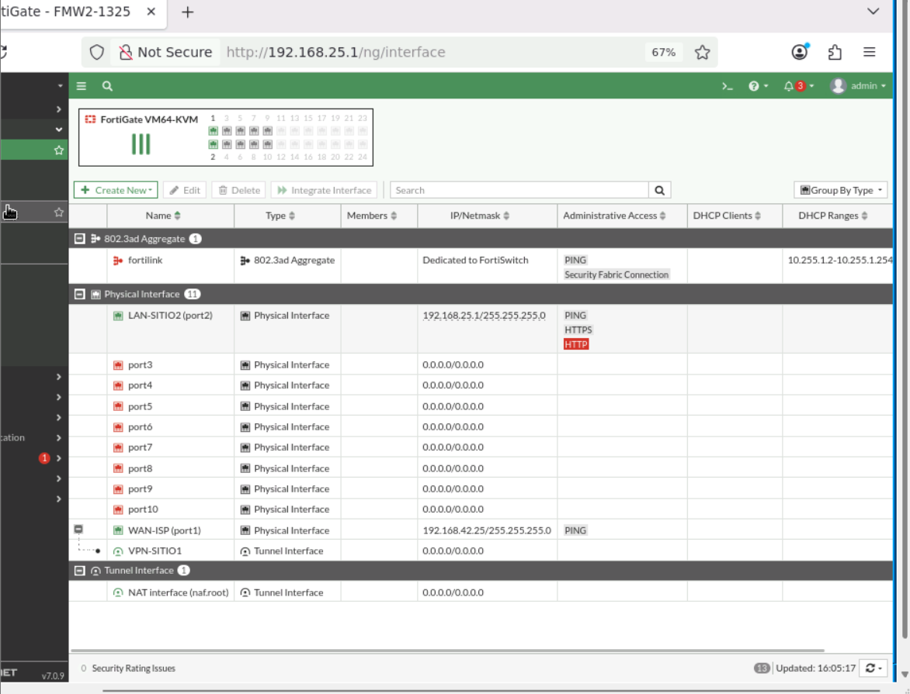

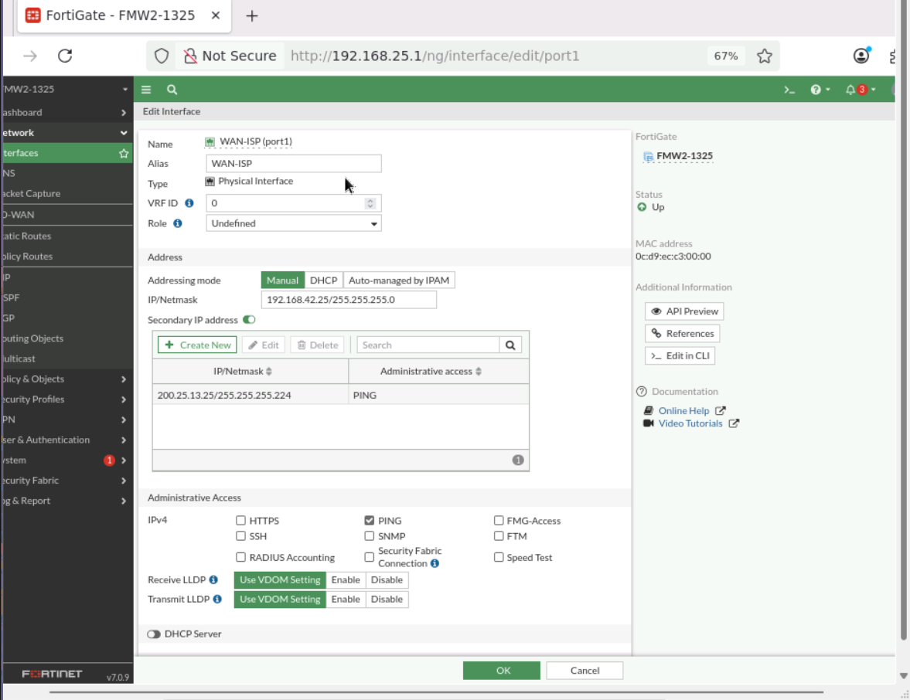

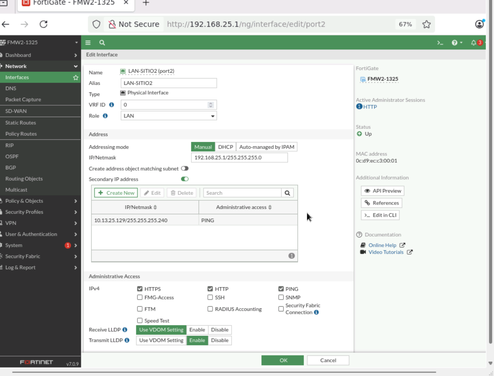

### 8.4 Network → DNS

| DNS servers | Primario | Secundario |
| --- | --- | --- |
| Specify | 8.8.8.8 | 1.1.1.1 |

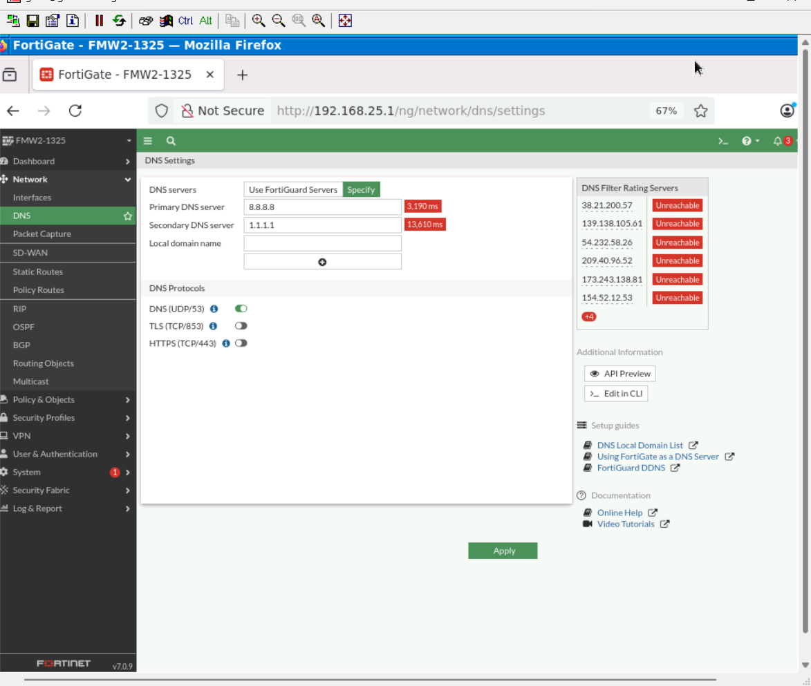

### 8.5 Network → Static Routes

| # | Destino | Gateway | Interfaz | Distancia | Quién la creó |
| --- | --- | --- | --- | --- | --- |
| 1 | 0.0.0.0/0 | 192.168.42.1 | port1 (WAN-ISP) | 10 | Yo, a mano (salida a Internet) |
| 2 | VPN-SITIO1_remote (10.13.25.0/25) | — | VPN-SITIO1 (túnel) | 10 | Asistente de VPN |
| 3 | VPN-SITIO1_remote (10.13.25.0/25) | — | Blackhole | 254 | Asistente de VPN |

La ruta 2 envía por el túnel todo lo que va hacia la LAN del Usuario. La ruta **Blackhole** solo se activa si el túnel cae: descarta ese tráfico en vez de dejarlo salir sin cifrar por la ruta por defecto.


### 8.6 Policy & Objects → Addresses

| Nombre | Tipo | Valor | Quién lo creó |
| --- | --- | --- | --- |
| LAN-SERVIDOR | Subnet | 10.13.25.128/28 | Yo, a mano |
| VPN-SITIO1_local_subnet_1 | Subnet | 10.13.25.128/28 | Asistente de VPN |
| VPN-SITIO1_remote_subnet_1 | Subnet | 10.13.25.0/25 | Asistente de VPN |
| VPN-SITIO1_local | Address Group | VPN-SITIO1_local_subnet_1 | Asistente de VPN |
| VPN-SITIO1_remote | Address Group | VPN-SITIO1_remote_subnet_1 | Asistente de VPN |


### 8.7 Policy & Objects → Firewall Policy

| # | Nombre | Entrada | Salida | Origen | Destino | Servicio | Acción | NAT | Log |
| --- | --- | --- | --- | --- | --- | --- | --- | --- | --- |
| 1 | SERVIDOR-INTERNET | port2 (LAN-SITIO2) | port1 (WAN-ISP) | LAN-SERVIDOR | all | ALL | ACCEPT | Enabled (IP de la interfaz de salida) | All Sessions |
| 2 | vpn_VPN-SITIO1_local_0 | port2 (LAN-SITIO2) | VPN-SITIO1 | VPN-SITIO1_local | VPN-SITIO1_remote | ALL | ACCEPT | Disabled | Security Events |
| 3 | vpn_VPN-SITIO1_remote_0 | VPN-SITIO1 | port2 (LAN-SITIO2) | VPN-SITIO1_remote | VPN-SITIO1_local | ALL | ACCEPT | Disabled | Security Events |
| — | Implicit Deny | any | any | all | all | ALL | DENY | — | — |

- **NAT:** `SERVIDOR-INTERNET` traduce el Servidor Web a `192.168.42.25` para que pueda salir a Internet. La usé para instalar Apache.
- **Reglas de la VPN:** la política 3 deja entrar al servidor el tráfico que llega descifrado desde el túnel (Usuario → Servidor Web). La política 2 permite el tráfico iniciado desde el servidor hacia la LAN del Usuario. Ninguna hace NAT, para que las IP internas viajen tal cual dentro del túnel.
- **Implicit Deny:** bloquea todo lo que no coincide con las políticas anteriores.

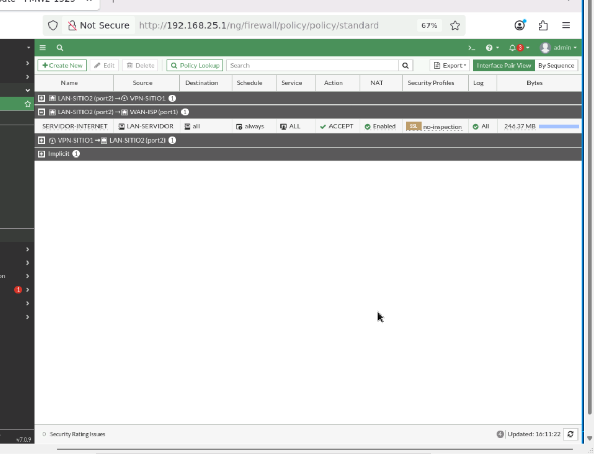

### 8.8 VPN → IPsec Tunnels → VPN-SITIO1 (lo único que cambié)

El túnel lo creé originalmente con el **IPsec Wizard** en la Infraestructura 1, con estos datos:

| Pantalla | Campo | Valor |
| --- | --- | --- |
| VPN Setup | Name | `VPN-SITIO1` |
| | Template type | Site to Site |
| | NAT configuration | No NAT between sites |
| Authentication | Remote IP address | `200.25.13.13` |
| | Outgoing Interface | port1 (WAN-ISP) |
| | Pre-shared Key | `Vpn#20251325` |
| Policy & Routing | Local interface | port2 |
| | Local subnets | 10.13.25.128/28 |
| | Remote subnets | 10.13.25.0/25 |

Como la IP pública del router es la misma que tenía el FW1 (`200.25.13.13`), **no tuve que cambiar el peer**. Solo edité los algoritmos de cifrado para que coincidieran con los del router:

| Sección | Campo | Infraestructura 1 (con FW1) | Infraestructura 2 (con el router) |
| --- | --- | --- | --- |
| Phase 1 Proposal | Encryption / Authentication | DES-MD5 y DES-SHA1 | **DES / MD5** (una sola propuesta) |
| | Diffie-Hellman | 14 y 5 | **5** |
| | Key Lifetime | 86400 s | 86400 s |
| Phase 2 | Encryption / Authentication | DES-MD5 y DES-SHA1 | **DES / MD5** |
| | PFS | Grupos 14 y 5 | **Grupo 5** |
| | Key Lifetime | 43200 s | **3600 s** |
| | Auto-negotiate | Desactivado | **Activado** |

**Configuración final del túnel:**

| Sección | Campo | Valor |
| --- | --- | --- |
| Network | Remote Gateway | Static IP Address `200.25.13.13` |
| | Interface | WAN-ISP (port1) |
| | Local Gateway | Secondary IP `200.25.13.25` |
| | NAT Traversal | Enable |
| | Keepalive Frequency | 10 s |
| | Dead Peer Detection | On Demand, 3 reintentos cada 20 s |
| Authentication | Method | Pre-shared Key |
| | IKE | Versión 1, modo Main (ID protection) |
| Phase 1 Proposal | Algoritmo | DES-MD5 |
| | Diffie-Hellman | Grupo 5 |
| | Key Lifetime | 86400 s |
| XAUTH | Type | Disabled |
| Phase 2 | Selector | VPN-SITIO1_local (10.13.25.128/28) ↔ VPN-SITIO1_remote (10.13.25.0/25) |
| | Algoritmo | DES-MD5 |
| | Replay Detection | Activado |
| | PFS | Activado, grupo 5 |
| | Auto-negotiate | Activado |
| | Key Lifetime | 3600 s |

Después de guardar, en *Dashboard → Network → IPsec* hice **Bring Down** del túnel y luego **Bring Up**, para que renegociara con los parámetros nuevos.

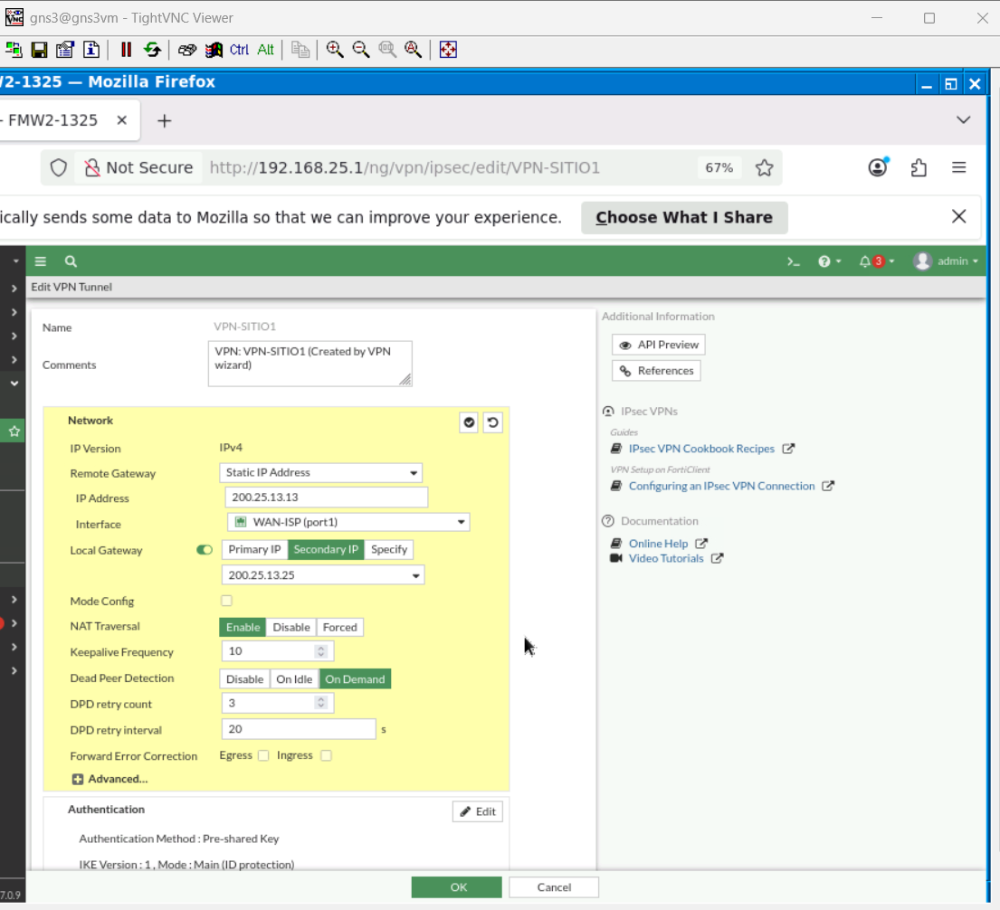

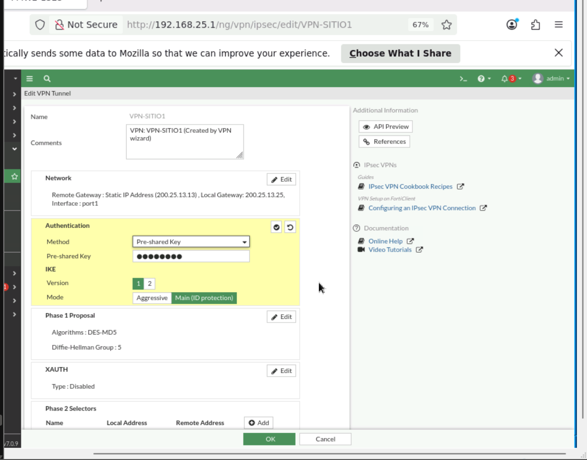

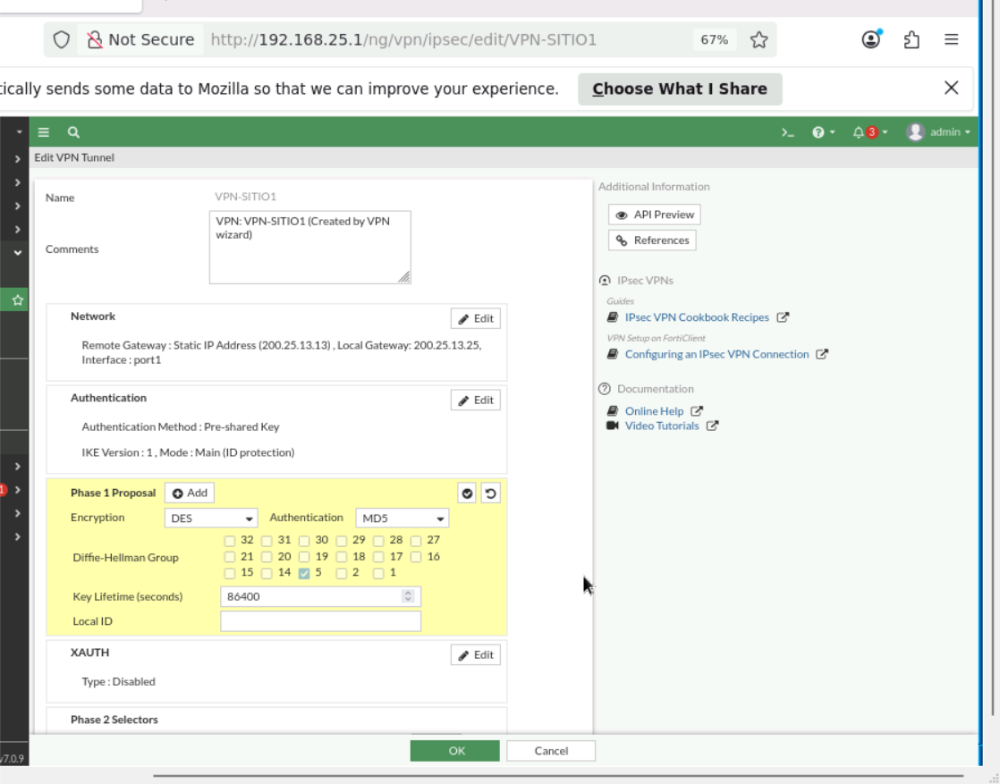

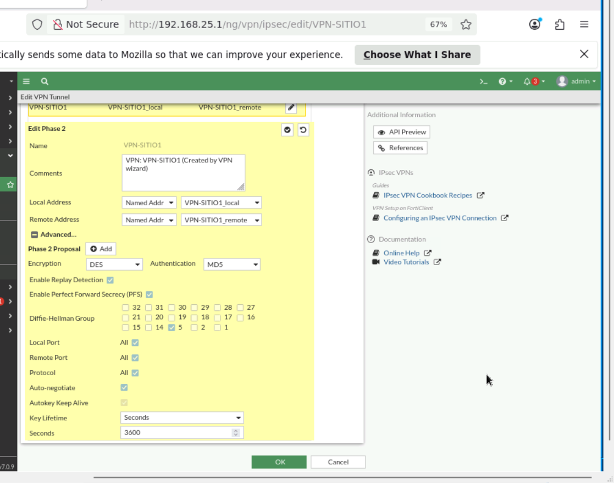

Running-config del túnel:

```
config vpn ipsec phase1-interface
    edit "VPN-SITIO1"
        set interface "port1"
        set local-gw 200.25.13.25
        set peertype any
        set net-device disable
        set proposal des-md5
        set comments "VPN: VPN-SITIO1 (Created by VPN wizard)"
        set dhgrp 5
        set remote-gw 200.25.13.13
        set psksecret ENC ...
    next
end

config vpn ipsec phase2-interface
    edit "VPN-SITIO1"
        set phase1name "VPN-SITIO1"
        set proposal des-md5
        set dhgrp 5
        set auto-negotiate enable
        set comments "VPN: VPN-SITIO1 (Created by VPN wizard)"
        set src-addr-type name
        set dst-addr-type name
        set keylifeseconds 3600
        set src-name "VPN-SITIO1_local"
        set dst-name "VPN-SITIO1_remote"
    next
end
```

### 8.9 Estado del túnel en el FortiGate

En *Dashboard → Network → IPsec* el túnel `VPN-SITIO1` aparece **Up**, con Fase 1 y Fase 2 en verde y Remote Gateway `200.25.13.13` (el router):

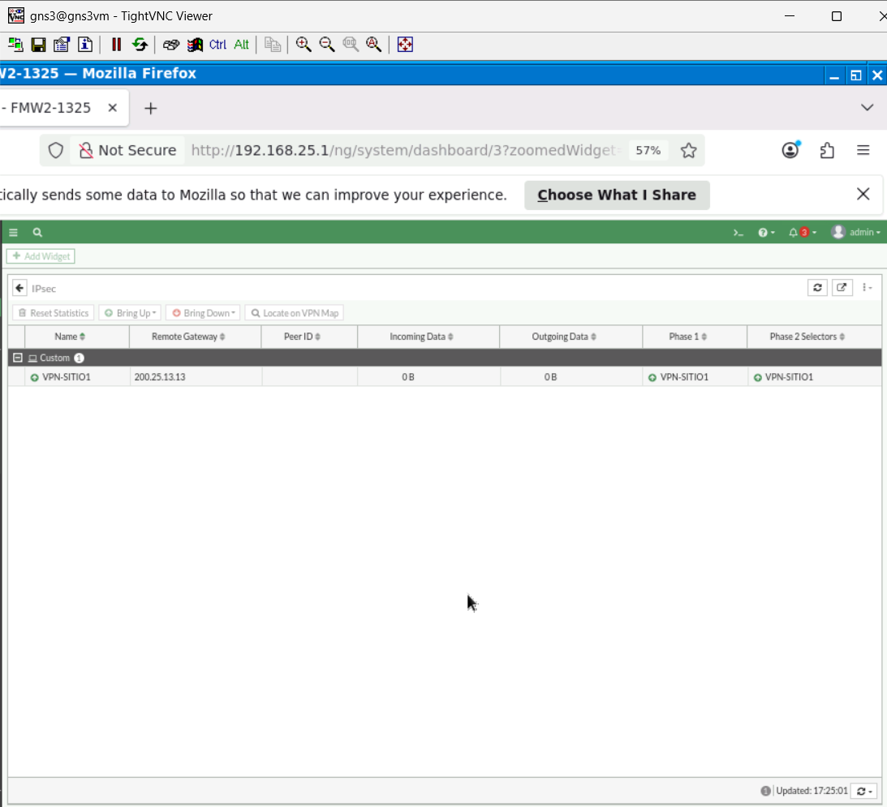

**Tipo de VPN en el FortiGate:** es una VPN **basada en rutas**. El tráfico entra al túnel porque la ruta estática hacia `10.13.25.0/25` apunta a la interfaz `VPN-SITIO1`.

---

## 9. Compatibilidad de la VPN entre Cisco y FortiGate

Para que el túnel se establezca, los dos extremos deben coincidir en todos estos parámetros:

| Parámetro | R1-1325 (Cisco) | FMW2-1325 (FortiGate) |
| --- | --- | --- |
| Peer local | 200.25.13.13 (IP principal de Fa0/0) | 200.25.13.25 (Local Gateway, IP secundaria de port1) |
| Peer remoto | 200.25.13.25 | 200.25.13.13 |
| Versión IKE / modo | IKEv1, Main Mode | IKEv1, Main (ID protection) |
| Autenticación | Pre-share `Vpn#20251325` | Pre-shared Key `Vpn#20251325` |
| Fase 1: cifrado / hash | DES / MD5 | DES / MD5 |
| Fase 1: Diffie-Hellman | Grupo 5 | Grupo 5 |
| Fase 1: lifetime | 86400 s | 86400 s |
| Fase 2: protocolo | ESP, modo túnel | ESP, modo túnel |
| Fase 2: cifrado / hash | esp-des / esp-md5-hmac | DES / MD5 |
| Fase 2: PFS | group5 | Grupo 5 |
| Fase 2: lifetime | 3600 s | 3600 s |
| Redes protegidas | 10.13.25.0/25 → 10.13.25.128/28 (ACL VPN-TRAFICO) | 10.13.25.128/28 → 10.13.25.0/25 (selectores de Fase 2) |
| Detección de peer caído | `crypto isakmp keepalive 10 3` | Dead Peer Detection On Demand |

**Por qué DES y MD5:** la licencia de evaluación de FortiOS 7.0.9 solo permite cifrado DES, y con DES solo ofrece MD5, SHA-256, SHA-384 o SHA-512 como hash. El c2691 con IOS 12.4 no soporta SHA-256 en ISAKMP, así que **MD5 es el único hash que tienen en común**. En una red real usaría AES-256 con SHA-256 o superior e IKEv2.

**VPN basada en políticas frente a basada en rutas:**

- El router usa un **crypto map**: cifra lo que coincide con una ACL.
- El FortiGate usa una **interfaz de túnel**: cifra lo que se enruta hacia ella.

Son compatibles porque, durante la Fase 2, los dos anuncian exactamente las mismas subredes (los *proxy IDs*). La ACL del router es el espejo del selector del FortiGate.

---

## 10. Dispositivos finales

### 10.1 Usuario (Ubuntu Cloud 24.04)

El Usuario no tiene ninguna configuración manual de red: usa **DHCP en `ens3`** (la imagen ya lo trae activado). SW1 lo pone en la VLAN 10 y el router le entregó estos datos:

| Parámetro | Valor |
| --- | --- |
| IP | 10.13.25.10/25 (dinámica) |
| Gateway | 10.13.25.1 (R1-1325) |
| DNS | 8.8.8.8 y 1.1.1.1 (el DHCP también instala rutas host hacia ellos por el gateway) |
| Lease | 86400 s (1 día, valor por defecto del DHCP de Cisco) |
| MTU | 1500 |

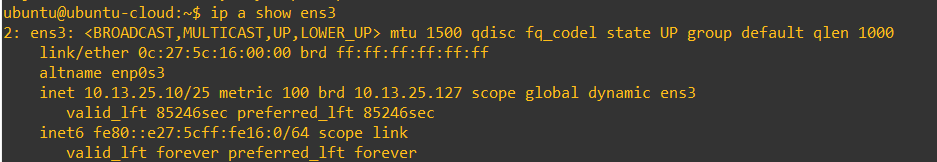

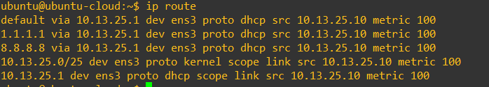

Para las pruebas instalé traceroute:

```bash
sudo apt update
sudo apt install -y traceroute
```

### 10.2 Servidor Web (Ubuntu Cloud 24.04)

Sin cambios respecto a la Infraestructura 1. Hostname `WEBSERVER-1325`.

| Parámetro | Valor |
| --- | --- |
| IP | 10.13.25.130/28 (fija) |
| Gateway | 10.13.25.129 (FMW2-1325) |
| DNS | 8.8.8.8 y 1.1.1.1 |
| MTU | 1400 |

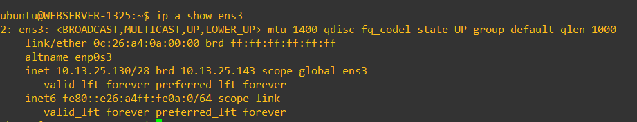

**IP fija con netplan.** Primero desactivé la configuración de red de cloud-init para que no sobrescribiera la IP fija, y luego escribí el netplan:

```bash
sudo -i
echo 'network: {config: disabled}' > /etc/cloud/cloud.cfg.d/99-disable-network-config.cfg
nano /etc/netplan/50-cloud-init.yaml
```

```yaml
network:
  version: 2
  ethernets:
    ens3:
      dhcp4: false
      addresses: [10.13.25.130/28]
      mtu: 1400
      routes:
        - to: default
          via: 10.13.25.129
      nameservers:
        addresses: [8.8.8.8, 1.1.1.1]
```

```bash
chmod 600 /etc/netplan/50-cloud-init.yaml
netplan apply
```

Puse `mtu: 1400` para dejar espacio a las cabeceras que añade IPsec (ESP y la nueva cabecera IP del modo túnel). Así los paquetes grandes del HTTPS no se fragmentan ni se pierden dentro del túnel.

**Apache con HTTPS:**

```bash
apt update
apt install -y apache2
a2enmod ssl
a2ensite default-ssl
systemctl restart apache2
echo '<h1>Servidor Web - Sitio 2 - Omar Paulino 20251325</h1>' > /var/www/html/index.html
```

El sitio `default-ssl` usa el certificado autofirmado (*snakeoil*) que Ubuntu genera al instalar Apache. Está emitido a nombre del hostname, no de la IP, por eso se accede con `curl -k`.

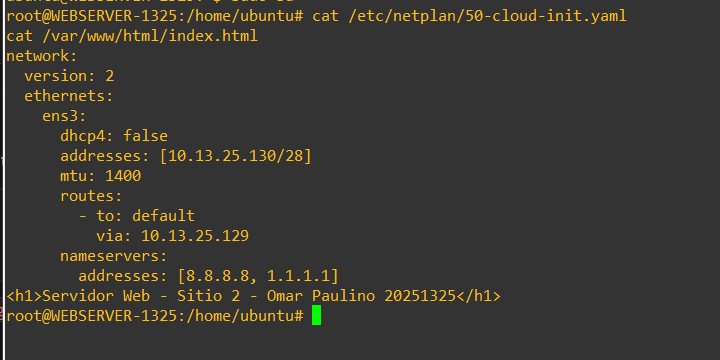

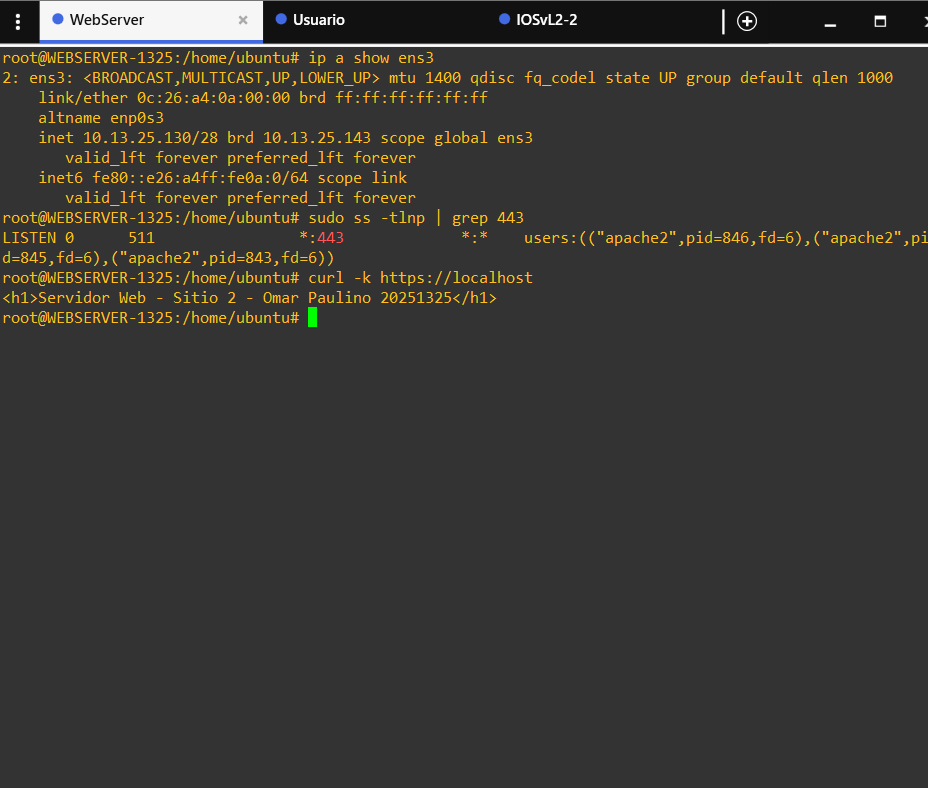

### 10.3 Webterm del Sitio 2

Lo uso solo para entrar a la GUI del FortiGate. Lo configuré en GNS3 con clic derecho → **Edit config**, con el nodo apagado:

```
auto eth0
iface eth0 inet static
	address 192.168.25.2
	netmask 255.255.255.0
	gateway 192.168.25.1
```
